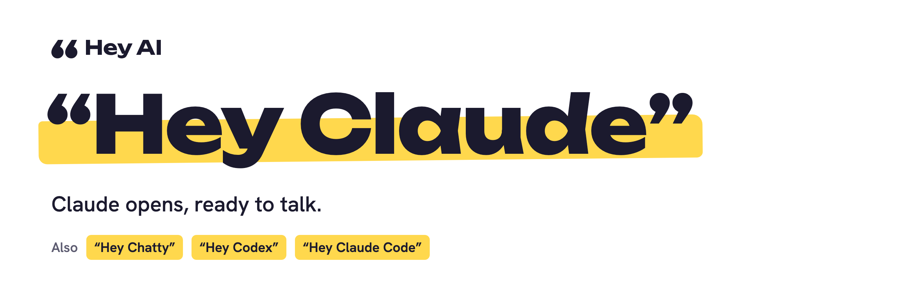
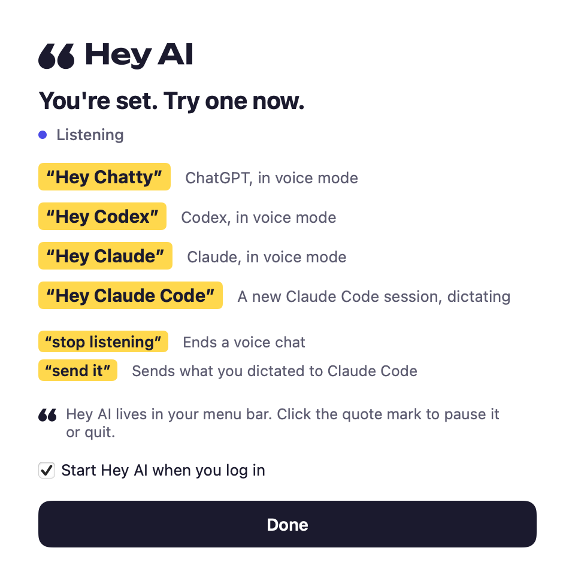

<p align="center">
  <picture>
    <source media="(prefers-color-scheme: dark)" srcset="brand/readme/banner-dark.png">
    
  </picture>
</p>

**Say an assistant's name and it opens, ready to talk.** Hey AI is a tiny Mac menu-bar app that listens for *“Hey Chatty”* (ChatGPT), *“Hey Claude”*, *“Hey Codex”* and *“Hey Claude Code”*, and opens that assistant with voice already on. Speech is recognized on your Mac, and nothing is recorded.

## Install

```bash
curl -fsSL https://raw.githubusercontent.com/notorious-d-e-v/hey-ai/main/install.sh | bash
```

Paste it into Terminal. About five seconds later Hey AI is in Applications and its setup window is open. Allow three permissions there, then say **“Hey Chatty”**.

You need macOS 14 or later (Apple silicon or Intel) and the current [ChatGPT](https://openai.com/chatgpt/download/) desktop app (the one with Codex built in) and/or the [Claude](https://claude.ai/download) desktop app. The older ChatGPT app has no voice mode Hey AI can start.

<p align="center"></p>

<details>
<summary>Download it yourself instead</summary>

Get `Hey-AI.zip` from [Releases](https://github.com/notorious-d-e-v/hey-ai/releases/latest), unzip it and drag **Hey AI** to Applications. Hey AI isn't notarized by Apple yet, so the first time you open it macOS says it can't check it. Open **System Settings → Privacy & Security** and click **Open Anyway**. (Files downloaded with `curl` aren't marked as downloaded, so the installer doesn't hit this check. That's a convenience, not a security feature. See [Security](#security).)

</details>

## What you can say

| Say | What happens |
| --- | --- |
| **“Hey Chatty”** | ChatGPT starts a new voice chat, right where you are. You don't have to switch to ChatGPT. |
| **“Hey Codex”** | Starts the same voice chat. ChatGPT's voice agent can hand work to Codex. |
| **“Hey Claude”** | Claude opens a new chat in voice mode. |
| **“Hey Claude Code”** | A new Claude Code session opens in the Claude app, already dictating. Finish with **“send it”**, or pause and say **“yes”**. |
| **“Stop listening”** | Ends whatever voice chat is open, right away. |

While ChatGPT or Claude is already listening, Hey AI ignores wake phrases, so talking to your assistant never opens a second one.

### ChatGPT's voice hotkey

ChatGPT has a *Voice Chat hotkey* (**Settings → Keyboard shortcuts**) that starts and stops a voice chat from any app. It has no default.

- **You already set one:** Hey AI uses it.
- **You haven't:** Hey AI sets it to **⌃⌥⌘V** by adding one entry to `~/.codex/keybindings.json`, and leaves everything else in that file alone.
- **When it starts working:** ChatGPT reads the hotkey when it starts, so Hey AI offers to restart ChatGPT. If you'd rather not, it kicks in the next time ChatGPT restarts.
- **Until then:** Hey AI brings ChatGPT forward and presses ⌃⇧V, ChatGPT's in-app voice shortcut. That shortcut only works with ChatGPT in front.

You can change the hotkey in ChatGPT's settings, and Hey AI uses your choice. If you remove it, Hey AI sets ⌃⌥⌘V again the next time it starts.

### Sending a Claude Code prompt

Claude Code has dictation rather than a voice conversation, so you speak your prompt and then send it:

- End with **“send it”** (or “send that”). It sends after a second of quiet.
- Or pause, then say **“yes”** (or “enter”, “send”, “done”) on its own. A prompt that ends “…and press enter” won't send.
- Pause for two seconds and a small bubble asks *Done? Say yes to send.* “Yeah” and “okay” work then too.
- If Claude ends the dictation itself (its own timeout, or you click its mic button), Hey AI sends what's there.

Hey AI removes the spoken command from the prompt before pressing Return. A pause on its own doesn't send unless Claude ends the dictation. If you switch to another app before it sends, it stops and sends nothing.

## Privacy

- **Your voice stays on your Mac.** Hey AI uses Apple's on-device speech recognition and never records audio.
- **It only acts on names.** Everything else it hears is discarded once it's checked.
- **The log is short.** `~/Library/Logs/HeyAI/heyai.log` records which phrase was heard and what was opened. Diagnostic dumps list only the buttons around the prompt box, never typed or dictated text or chat titles. Still, read it before you attach it to a public issue.
- **You'll see the orange microphone dot** while it listens. Pause it from the menu bar any time. Listening costs about 3% of one CPU core and 150 MB of memory on an M4 Pro, nearly all of it Apple's speech recognizer.
- **No network, no analytics.** Hey AI makes no network requests of its own. (The menu has an *Allow Online Speech Recognition* fallback, off by default, for Macs without on-device speech. It sends audio to Apple, so leave it off unless you need it.)

## Permissions

| Permission | Why Hey AI needs it |
| --- | --- |
| Microphone | To hear the wake phrase. |
| Speech Recognition | To turn speech into text, on your Mac. |
| Accessibility | ChatGPT and Claude have no “start voice” link. After a wake phrase, Hey AI presses the app's own shortcut (ChatGPT's voice hotkey, ⌘D in Claude Code) or Claude's voice button. |

The setup window asks for all three in one pass. macOS doesn't let apps switch Accessibility on themselves, so you flip one switch in the list it opens, which needs an administrator's password.

Accessibility is a broad permission: it would let an app read and control any window. Hey AI only acts on ChatGPT and Claude, and only after a wake phrase. Before every key press it sends to an app, it checks that the app is still in front. The exception is ChatGPT's voice hotkey, which works from any app. All of it is in [`Sources/Launcher.swift`](Sources/Launcher.swift).

## Menu

Click the quote mark in the menu bar to see whether Hey AI is listening, pause it, open setup again or choose whether it starts at login. Each phrase in the menu is also a button: click “Hey Chatty” to open ChatGPT voice without saying a word.

**Keep Screen Awake** stops the display from sleeping, so your Mac doesn't lock on its own and wake phrases keep working while you step away. It also means an unattended Mac stays unlocked, so only turn it on where that's fine.

<details>
<summary>How it works</summary>

- **Listening.** `SFSpeechRecognizer` in on-device mode runs over the microphone. Recognition restarts every 50 seconds and after each wake phrase, so an old phrase can never fire twice. Common mishearings are accepted (“chati”, “cloud”, “clawed”, “codecs”). See [`Sources/WakeMatcher.swift`](Sources/WakeMatcher.swift).
- **Claude.** Opens `claude://claude.ai/new`, then presses the composer's *Use voice mode* button through Accessibility.
- **Claude Code.** Opens `claude://code/new`, then presses ⌘D, Claude's dictation shortcut.
- **ChatGPT and Codex.** Presses ChatGPT's Voice Chat hotkey, which starts a voice chat (or stops or cancels one) without bringing ChatGPT forward. Until ChatGPT has the hotkey, Hey AI brings it forward and presses ⌃⇧V instead. See [`Sources/ChatGPTHotkey.swift`](Sources/ChatGPTHotkey.swift).
- **Already listening?** Core Audio reports which processes are using the microphone. If ChatGPT or Claude is, wake phrases are ignored.

</details>

<details>
<summary>Troubleshooting</summary>

- **Nothing happens when I talk.** The menu should say *Listening on-device*. If it says on-device speech isn't available, turn on Dictation in **System Settings → Keyboard** so macOS downloads it.
- **The app opens but voice doesn't start.** Check that Hey AI is switched on under **System Settings → Privacy & Security → Accessibility**. If it is, ChatGPT or Claude may have changed its layout. Choose **Test → Write Claude Controls to Log** and open an issue with the log.
- **It doesn't work while my Mac is locked.** macOS doesn't let any app drive other apps behind the lock screen. **Keep Screen Awake** stops the display from sleeping so the Mac doesn't lock on its own, which leaves an unattended Mac unlocked.
- **I can't see the quote mark in the menu bar.** On a MacBook with a notch, macOS hides menu-bar icons behind the notch when there isn't room. Hey AI keeps listening either way. Hold ⌘ and drag a few icons off the menu bar to make room, or open Hey AI from Applications to see its window.
- **My AirPods sound worse.** While any app holds an AirPods microphone, macOS switches them to call-quality audio. Pick your Mac's built-in microphone as the input.

</details>

## Security

- **The installer** is [`install.sh`](install.sh). It downloads the latest release zip, refuses to continue if the release's SHA-256 file is missing or doesn't match, moves the app to Applications and opens it. Read it before piping it to `bash`, or download the app yourself.
- **Releases are built by GitHub Actions** from a tagged commit ([workflow](.github/workflows/release.yml)), with a build attestation you can check: `gh attestation verify Hey-AI.zip -R notorious-d-e-v/hey-ai`.
- **The app is signed ad hoc, not with an Apple Developer ID**, and isn't notarized yet. Its code signature requires only the bundle identifier, so updates keep the permissions you granted. The trade-off is that another ad-hoc-signed app using the same identifier could inherit them. A Developer ID signature will replace this.
- **Build it yourself** if you'd rather trust only source: see below.

## Uninstall

```bash
curl -fsSL https://raw.githubusercontent.com/notorious-d-e-v/hey-ai/main/uninstall.sh | bash
```

It removes the app, its settings, logs and permissions, and its login item (if Hey AI is running when you uninstall; otherwise it tells you where to remove it).

## Build from source

You only need Apple's Command Line Tools (`xcode-select --install`), not Xcode.

```bash
git clone https://github.com/notorious-d-e-v/hey-ai.git && cd hey-ai && ./build.sh && open "build/Hey AI.app"
```

`./build.sh` runs the phrase tests, then builds a universal app. `./scripts/release.sh` makes the release zip.

---

Hey AI is free and open source under the [MIT license](LICENSE). Brand guidelines are in [`brand/BRAND.md`](brand/BRAND.md).

ChatGPT and Codex are trademarks of OpenAI. Claude and Claude Code are trademarks of Anthropic. Hey AI is an independent project, not affiliated with or endorsed by either company.
