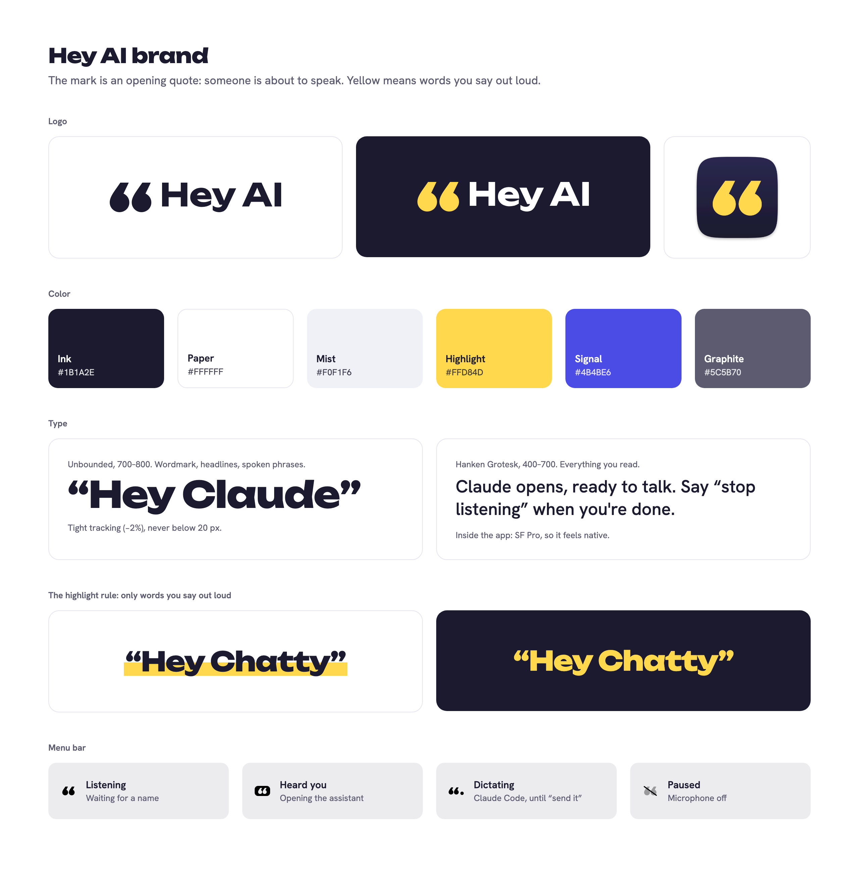

# Hey AI brand

## The idea

You *say* the words, so the brand is built on speech written down. The mark is an **opening quotation mark**: someone is about to speak. **Yellow is a highlighter for words you say out loud**, and nothing else.

## Name

- Write **Hey AI**: two words, capital H, capital A and I.
- In code, file names and bundle IDs, use `HeyAI` / `heyai`. Never write `HeyAI` in prose.
- Wake phrases are proper nouns in curly quotes: “Hey Claude”, “Hey Chatty”, “Hey Codex”, “Hey Claude Code”. Lowercase only when quoting a command mid-sentence (“send it”, “stop listening”).

## Logo

| File | Use |
| --- | --- |
| [`logo/mark-ink.svg`](logo/mark-ink.svg) | The mark on light backgrounds |
| [`logo/mark-highlight.svg`](logo/mark-highlight.svg) | The mark on Ink |
| [`logo/wordmark-ink.svg`](logo/wordmark-ink.svg), [`logo/wordmark-white.svg`](logo/wordmark-white.svg) | “Hey AI” set in Unbounded Bold |
| [`logo/app-icon.svg`](logo/app-icon.svg), [`logo/app-icon-1024.png`](logo/app-icon-1024.png) | The app icon: the Highlight mark on an Ink macOS tile |
| [`logo/menubar-*.png`](logo) | Menu-bar states, exported from the app's own drawing code |

- The lockup is the mark followed by the wordmark, with a gap of half the mark's width, aligned to the cap height.
- Keep clear space around the logo equal to the height of one quote dot.
- Smallest sizes: the mark at 16 px tall, the lockup at 96 px wide.
- On light backgrounds the mark is Ink. On Ink it is Highlight. No other colors, gradients, outlines or shadows.
- Don't rotate the mark, flip it into a closing quote (”) or put anything inside it.

The mark and wordmark are outlined from [Unbounded](https://fonts.google.com/specimen/Unbounded) (SIL Open Font License) by [`scripts/outline_logo.py`](scripts/outline_logo.py), so the SVGs need no fonts.

## Color

| Name | Hex | Use |
| --- | --- | --- |
| Ink | `#1B1A2E` | Text, the app icon, dark backgrounds |
| Paper | `#FFFFFF` | Light backgrounds |
| Mist | `#F0F1F6` | Secondary surfaces, chips, code blocks |
| Highlight | `#FFD84D` | **Only** words said out loud, and the mark on Ink |
| Signal | `#4B4BE6` | Links, focus rings, “listening” status. On Ink use `#9C9CFF` |
| Graphite | `#5C5B70` | Secondary text. On Ink use `#B9B8CC` |

Contrast (WCAG): Ink on Paper 17:1, Ink on Highlight 12.3:1, Highlight on Ink 12.3:1, Graphite on Paper 6.6:1, Signal on Paper 6.1:1. **Never** put white text on Highlight or Highlight on white (1.4:1).

## The highlight rule

Highlight marks exactly one thing: words you say to Hey AI.

- **Large phrases on light backgrounds** (banners, cards): draw a marker stroke behind the phrase, covering the lower half of the letters, set slightly off level (−0.6°) with uneven corners, like a real highlighter. Text stays Ink. On the web, where a phrase can wrap, the stroke is drawn level, once per line.
- **Large phrases on Ink**: set the phrase itself in Highlight, with no stroke.
- **Small phrases** (pills in the app, tables, chips): a Highlight background with Ink text, on any background. At small sizes the pill reads better than colored text.
- Never highlight anything else for emphasis: not product names, not prices, not “free”. Buttons and other controls never use Highlight either. If everything is yellow, nothing is something to say.

## Type

| Typeface | Weights | Use |
| --- | --- | --- |
| [Unbounded](https://fonts.google.com/specimen/Unbounded) | 700–800 | Wordmark, headlines, spoken phrases set large. Tracking −2%. Never below 20 px. |
| [Hanken Grotesk](https://fonts.google.com/specimen/Hanken+Grotesk) | 400–700 | Everything people read: body, captions, buttons. |
| SF Pro (system) | | Inside the app, so it feels like part of macOS. |
| `ui-monospace` | | Terminal commands only. |

Both web fonts are free under the SIL Open Font License.

## Voice

Write the way you'd tell a friend how to use it.

- **Short and plain.** “Say ‘Hey Claude’. Claude opens, ready to talk.” Not “Unlock seamless voice-first AI workflows.”
- **Use the real phrases.** Show what to say instead of describing it.
- **Say what happens.** Buttons name their result (“Allow access”, “Copy”). Errors say what went wrong and what to do next, without apologizing.
- **Sentence case** everywhere. No all-caps labels and no exclamation marks. The one exception is macOS menu items, which follow Apple's Title Case convention so the menu feels native.
- **Honest about limits.** It can't work behind the lock screen; say so.

Words to avoid: seamless, supercharge, revolutionary, effortless, magic, game-changer, unleash, AI-powered.

Posts from a person's own account (the launch thread on X, for example) can keep that person's style, lowercase included. The product's own surfaces (app, site, README, store pages) follow this guide.

## Motion

One moment: when a phrase appears, the highlighter sweeps in from left to right (about 420 ms, ease-out). Nothing else animates on its own. With reduced motion turned on, phrases appear already highlighted.

## The app

- The menu-bar icon is the mark, drawn as a template image so macOS tints it. States: listening (mark), heard you (mark knocked out of a filled pill), dictating to Claude Code (smaller mark plus a dot), paused (dimmed mark with a slash).
- The setup window is Paper with Ink type. Steps are numbered because they happen in order, and each turns into an Ink circle with a Highlight check when it's done. Wake phrases appear as Highlight pills.
- The “Done?” nudge uses the same rule: Ink text on white, with “yes” highlighted.
- Status dots: a filled Signal dot means listening; a hollow Graphite ring means it isn't.

## Other companies' names

Refer to Claude, Claude Code, ChatGPT and Codex by name in plain text. Never use their logos, colors or typefaces, and never imply endorsement. Wherever the brand appears at length (site, README, store pages), include: *Claude and Claude Code are trademarks of Anthropic. ChatGPT and Codex are trademarks of OpenAI. Hey AI is an independent project.*

## Regenerating assets

- `scripts/build_icon.sh` rebuilds the app icon SVG, its 1024 px PNG and `Resources/AppIcon.icns` (needs Google Chrome).
- `src/render.sh` re-renders the README banners, social card and this brand sheet from `src/*.html` (needs Google Chrome).
- `tools/snapshot.sh /tmp/out brand/logo` renders the app's setup window and menu-bar icons.
